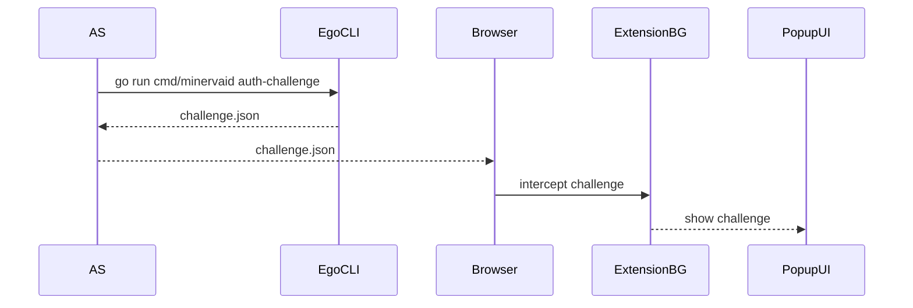
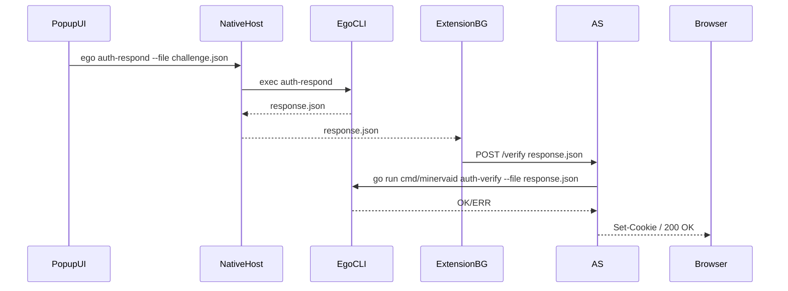
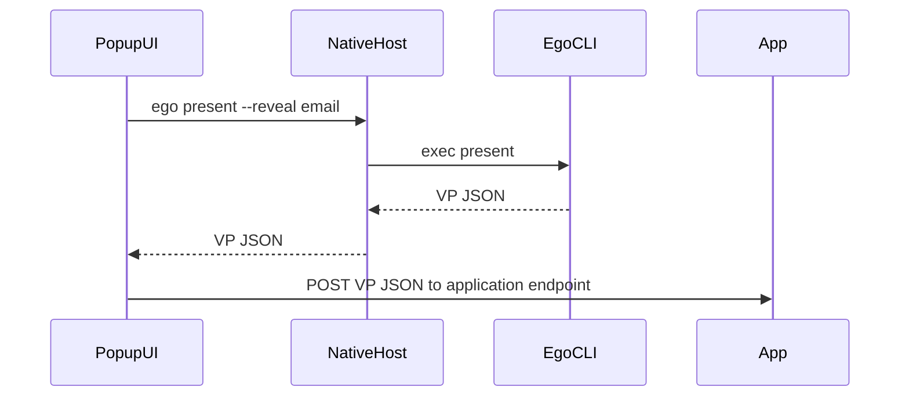

# Ego Wallet Extension — Architecture Overview

This document describes the key components and data flows in the Ego Wallet browser extension, which acts as a lightweight UI/bridge to the core Ego CLI.

---

## 1. High-Level Components

```
┌───────────┐    Native     ┌───────────┐    CLI    ┌────────────┐
│  Browser  │←────────────▶│ Extension │←─────────▶│  Ego CLI   │
│  (WebApp) │   Messaging   │ Background│           │ (minervaid)│
└───────────┘               │  Script   │           └────────────┘
     │                       └───────────┘
     │ HTTP redirect                  ▲
     ▼          Popup UI             │
┌─────────┐  ┌───────────┐            │
│   AS    │  │  Popup /  │────────────┘
│ (Auth   │  │  Panel    │
│ Server) │  └───────────┘
└─────────┘
```

1. **Browser (WebApp / RP)**

   * User clicks “Login” → redirects to the AS `/authorize` endpoint.

2. **Authorization Server (AS)**

   * Runs `minervaid auth-challenge` to mint a challenge JSON.
   * Persists the nonce in session, returns `challenge.json` to the browser.

3. **Extension Background Script**

   * Intercepts the response or listens for `challenge.json`.
   * Forwards it to the Popup UI via Chrome messaging.

4. **Extension Popup / Panel**

   * Displays a consent dialog showing requested fields or domain.
   * On user approval, invokes the Native Messaging Host.

5. **Native Messaging Host**

   * Receives JSON message `{ cmd: [...] }` from the extension.
   * Spawns the Ego CLI (`ego auth-respond` or other commands).
   * Streams `stdout`/`stderr` back to the extension.

6. **Ego CLI (minervaid)**

   * Implements all SSI primitives (DID generation, credential issuance, signing, challenge-response).
   * Reads from and writes to the local vault (`store/...`).

---

## 2. Directory & Configuration Layout

```
~/.ego/config.json        // stores “active” vault name & rootDir
/store/                   // default root for vaults
  └─ alice/               // vault “alice”
     ├─ did.json
     ├─ keystore.json
     ├─ attributes.json
     ├─ credentials/      // VCs
     ├─ presentations/    // VPs
     └─ revocations.json
```

* **CLI** uses `config.json` to resolve the active vault.
* **Extension** reads `config.json` via the Native Host to present vault choices.

---

## 3. Data Flows

### 3.1 Authentication Challenge



### 3.2 Challenge Response



### 3.3 Verifiable Presentations



---

## 4. Message Protocol (Native Messaging)

All messages between the Extension and the Native Host use JSON:

**Request from Extension:**

```json
{ "cmd": ["auth-respond", "--did", "did:key:z…", "--file", "challenge.json"] }
```

**Response from Native Host:**

```json
{
  "code": 0,
  "stdout": "{ …response.json contents… }",
  "stderr": ""
}
```

---

## 5. Extensibility & Plugins

* **Plugin hooks**: The Native Host can dispatch commands to either:

  * Built-in Ego CLI, or
  * External scripts placed in `~/.ego/plugins/`.

As new SSI features (ZKP proofs, etc.) are added to `ego`, the extension can invoke them without further changes.

---

## 6. Security Considerations

* **Key isolation**: Private keys remain within the CLI process.
* **Native Host**: Must be registered/trusted by the browser for security.
* **Browser permissions**: Limit `webRequest` to the AS domain to prevent eavesdropping.
* **Session store**: AS must enforce single-use, expiring challenges to guard against replay attacks.
